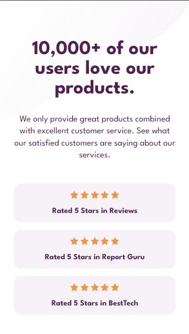
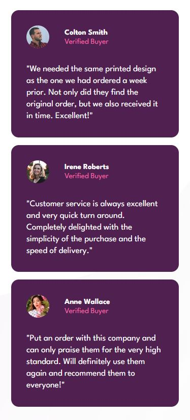
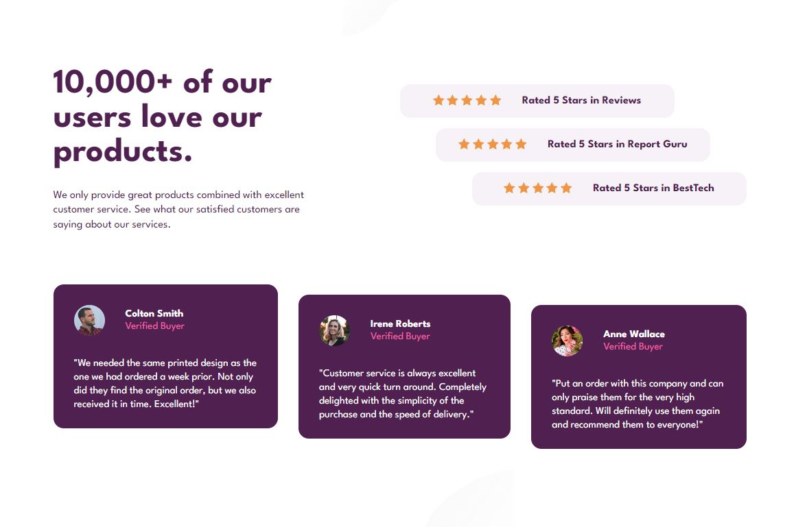

# Frontend Mentor - Social proof section solution

This is a solution to the [Social proof section challenge on Frontend Mentor](https://www.frontendmentor.io/challenges/social-proof-section-6e0qTv_bA). Frontend Mentor challenges help you improve your coding skills by building realistic projects. 

## Table of contents

- [Overview](#overview)
  - [The challenge](#the-challenge)
  - [Screenshot](#screenshot)
  - [Links](#links)
- [My process](#my-process)
  - [Built with](#built-with)
  - [What I learned](#what-i-learned)
  - [Continued development](#continued-development)
- [Author](#author)

**Note: Delete this note and update the table of contents based on what sections you keep.**

## Overview

### The challenge

Users should be able to:

- View the optimal layout for the section depending on their device's screen size

### Screenshot

### Links

- Solution URL: [github](https://github.com/abuk111/Interactive-rating-component)
- Live Site URL: [click](https://abuk111.github.io/Interactive-rating-component/)

## My process

### Built with

- Semantic HTML5 markup
- CSS custom properties
- Flexbox
- BEM
- Mobile-first workflow

### What I learned

I really liked to doing this challenge. The trickiest part was desktop version and components which are not in one line. 

### Continued development

This project is finished

## Author

- Website - [Github](https://github.com/abuk111)
- Frontend Mentor - [@abuk111](https://www.frontendmentor.io/profile/abuk111)
- Twitter - [@JakubKulik94](https://twitter.com/JakubKulik94)

